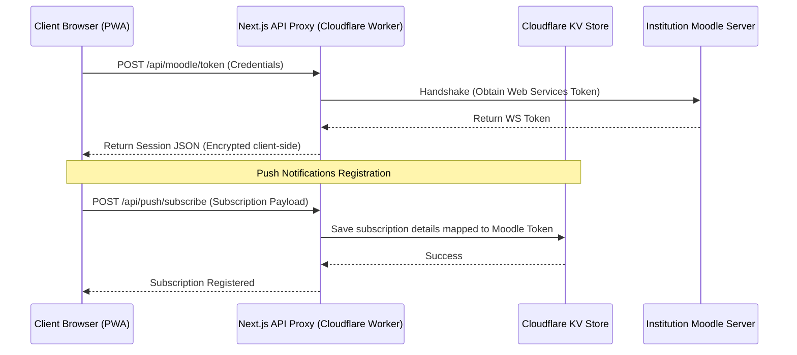

# 📚 Noti-LMS

### A Tesla-Inspired Academic Command Center & Web Push System for Moodle LMS

[](https://notilms.noppakornwunnoy01.workers.dev/)
[](https://nextjs.org/)
[](https://www.typescriptlang.org/)
[](https://workers.cloudflare.com/)
[](https://tailwindcss.com/)

> **🔗 Live URL:** [https://notilms.noppakornwunnoy01.workers.dev/](https://notilms.noppakornwunnoy01.workers.dev/)

---

## 📖 Overview

**Noti-LMS** is a high-performance, edge-rendered PWA dashboard designed to streamline the student workflow. It integrates directly with the **Moodle REST API**, aggregating assignments, quizzes, and exams across all enrolled courses into a single, cohesive command center. 

By eliminating the fragmented, click-heavy layout of standard Moodle platforms, Noti-LMS offers a unified workspace where students can track deadlines, receive background push notifications, and access tasks directly.

---

## 🎨 Tesla Aesthetic & Design Philosophy

The user interface of Noti-LMS is meticulously styled based on the **Tesla Design System** principles of radical layout subtraction and high contrast.

- **Extreme Minimalism:** No decorative gradients, heavy box-shadows, or extraneous borders. Depth is created purely using white space, layout alignment, and flat gray tones (`#F4F4F4` light mode / `#111318` dark mode).
- **Responsive Typography:** Features system-native fallbacks mirroring modern display faces (such as "Universal Sans Text" and "Universal Sans Display") for a clean, premium appearance.
- **Micro-Animations:** Fluid, responsive user interactions powered by custom-tailored transition curves (`cubic-bezier(0.5, 0, 0, 0.75)` with a `330ms` timing window).
- **Three-State Collapsible Sidebar (Desktop):** 
  - **Expanded:** Standard wide view containing full descriptive labels, themes, and user settings.
  - **Collapsed:** A compact `72px` sidebar displaying only navigation icons, maximizing screen space while keeping views accessible.
  - **Hidden:** Completely hides the sidebar from the workspace, showing a clean `☰` toggle next to the page title.
- **Mobile-First Optimizations:** Lock-in screen parameters (`user-scalable=no`, `maximum-scale=1`) coupled with flexbox box-model bounds preventing accidental horizontal overflow scrolling.

---

## ✨ Key Features

| Feature | Technical Implementation |
|---|---|
| 🔐 **Secure Authentication** | Direct Moodle Web Services API handshakes with short-lived session token exchanges. |
| 📋 **Unified Command Center** | Smart categorization of tasks sorted by remaining duration and critical level. |
| 🔔 **Edge Push Subsystem** | Custom Web Push subscription manager stored in **Cloudflare KV**, delivering alerts even when the browser is closed. |
| 📱 **PWA & Offline Capability** | Standard service worker caching with custom iOS Safari & Android Chrome install prompts. |
| 📐 **Dynamic Layouts** | Fluid grid views for Today, Week, Month calendar, and granular Course Breakdowns. |
| ⚡ **Zero-Server Overhead** | Deployed entirely on Cloudflare's serverless edge infrastructure. |

---

## 🏗️ Architecture & Data Flow



### 1. The Push Subsystem
- **Subscription Store:** The app requests permission via the browser Web Push API, sending the payload to `/api/push/subscribe`. Subscriptions are safely registered inside the Cloudflare KV database (`NOTI_LMS_KV`).
- **Push Server Agent:** When the automated background checker trigger runs, it queries active sessions, contacts the respective Moodle API endpoint to fetch task deltas, and dispatches custom Web Push notifications via VAPID keys.

### 2. The PWA Engine
- Registered via `public/sw.js` to enable background push notification events (`push` and `notificationclick`).
- Features a custom PWA installation module (`components/pwa-install-prompt.tsx`) that detects platforms (safeguarding iOS Safari "Add to Home Screen" instructions and prompt interceptors on Android Chrome).

---

## 📁 Project Directory Structure

```
Noti-LMS/
├── app/
│   ├── api/
│   │   ├── moodle/
│   │   │   ├── token/route.ts       # Moodle authentication proxy
│   │   │   └── rest/route.ts        # Moodle REST API proxy
│   │   └── push/
│   │       ├── subscribe/route.ts   # Subscriptions registration endpoint
│   │       └── send/route.ts        # Dispatch/test push notifications
│   ├── globals.css                  # Core CSS variables, Tailwind imports, and transitions
│   ├── layout.tsx                   # Page viewport settings and theme hooks
│   └── page.tsx                     # Main routing view
├── components/
│   ├── dashboard-app.tsx            # Shell component, Sidebar, Header, and views logic
│   ├── pwa-install-prompt.tsx       # Smart OS PWA installation cards
│   ├── query-provider.tsx          # React Query state hydration wrapper
│   └── ui/                          # Standard minimalist buttons and badges
├── lib/
│   ├── types.ts                     # Strict TypeScript interfaces
│   ├── moodle-url.ts                # Sanitizes input URLs (e.g. stripping web-services paths)
│   ├── push-client.ts               # Subscriptions and worker registration client-side helpers
│   ├── push-db.ts                   # Subscriber storage wrapper interacting with Cloudflare KV
│   └── utils.ts                     # Design class merging utility (clsx + tailwind-merge)
├── public/
│   ├── manifest.json                # PWA capability credentials
│   └── sw.js                        # Background Service Worker events listener
├── wrangler.jsonc                   # Cloudflare binding and worker configuration file
├── open-next.config.ts              # OpenNext bundling rules
└── DESIGN-tesla.md                  # Comprehensive guidelines on Tesla design system compliance
```

---

## 🚀 Installation & Local Development

### Prerequisites
- [Node.js](https://nodejs.org/) >= 18.x (Recommended: v22.x)
- Enabled Moodle Mobile Web service (`webservice/rest/server.php`) on your target Moodle instance.

### Setup Steps

1. **Clone and Install:**
   ```bash
   git clone https://github.com/noppakorn001/Noti-LMS.git
   cd Noti-LMS
   npm install
   ```

2. **Configure Environment Variables:**
   Create a `.env.local` file in the root directory:
   ```env
   NEXT_PUBLIC_VAPID_PUBLIC_KEY=BKkCBTXev6dqy1iwUgCLyK0NX4sYKilrT-Ja_M-eF3g7-5FINxqn2nQ6ti8x18-aUg7H254k9h7eFdyTvzKfbnU
   VAPID_PRIVATE_KEY=your_vapid_private_key_here
   VAPID_SUBJECT=mailto:your-email@example.com
   ```

3. **Start Local Development:**
   ```bash
   # Standard dev command
   npm run dev
   
   # Or run via local bash helper script
   ./run.sh
   ```

---

## ☁️ Deployment (Cloudflare Workers / Pages)

This project leverages `@opennextjs/cloudflare` to compile the Next.js App Router for Cloudflare Workers.

### 1. Create a Cloudflare KV Namespace
Run the following command to create a namespace for the push subscriptions:
```bash
npx wrangler kv namespace create NOTI_LMS_KV
```
Update your `wrangler.jsonc` file with the returned namespace ID:
```json
"kv_namespaces": [
  {
    "binding": "NOTI_LMS_KV",
    "id": "your_kv_namespace_id_here"
  }
]
```

### 2. Build and Deploy
```bash
# Build production assets
npm run build:cf

# Deploy to Cloudflare Worker
npm run deploy
```

---

## 🔒 Security & Data Privacy

1. **Zero-Session Storage on Server:** Credentials (usernames, passwords, web tokens) are passed directly through the proxy to the target Moodle server. No user database is maintained on the server.
2. **Web Push Subscriptions Encryption:** Subscription payloads are stored securely inside Cloudflare's Edge KV store. Subscription records are indexed using a non-reversible cryptographic hash.
3. **CORS Security:** Direct connections from the client to the Moodle server are prohibited to protect against browser cross-origin leaks. All traffic travels securely over HTTPS.

---

<div align="center">

Built with ❤️ by **Noppakorn** | Deployed on the Cloudflare Global Edge Network

</div>
