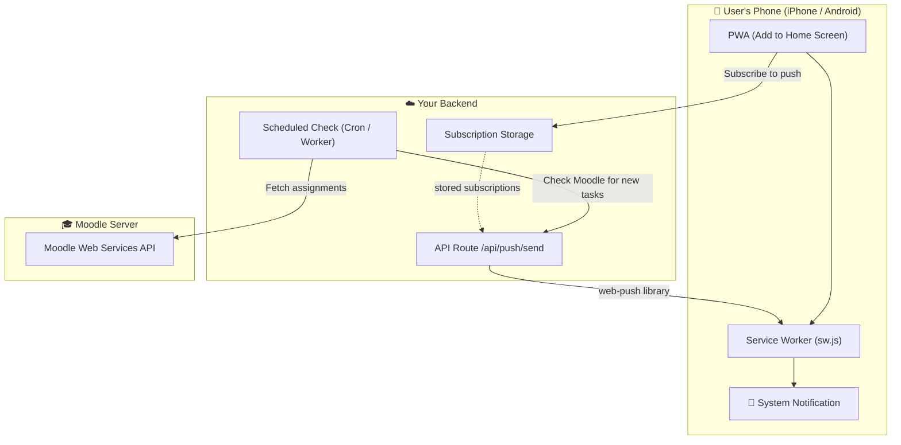

# 📱 Noti-LMS — Mobile Push Notifications Guide

## Current State of Notifications

After scanning the entire project, here is what currently exists:

| Component | Status |
|---|---|
| `Notification.requestPermission()` | ✅ Exists in [dashboard-app.tsx](file:///home/noppakorn/Desktop/Project/Noti-LMS/components/dashboard-app.tsx#L338-L341) |
| `new Notification()` constructor | ✅ Exists (with try-catch fallback) |
| Service Worker file | ❌ **Missing** — no `sw.js` or `service-worker.js` |
| PWA Manifest (`manifest.json`) | ❌ **Missing** — no web app manifest |
| Push API subscription (`PushManager.subscribe`) | ❌ **Missing** |
| Backend push server (VAPID / FCM) | ❌ **Missing** |

> [!IMPORTANT]
> The current notification system **only works on desktop browsers** and only while the tab is open. It uses `new Notification()` which is a **foreground-only, in-tab API**. It does **not** work on mobile phones at all.

---

## How Mobile Notifications Work — The Key Differences

### 🍎 iPhone (iOS Safari)

| Requirement | Details |
|---|---|
| iOS version | **16.4+** required |
| Must be PWA | User **must** "Add to Home Screen" first |
| Service Worker | **Required** — notifications only work through `ServiceWorkerRegistration.showNotification()` |
| `new Notification()` | ❌ **Blocked** — always throws `Illegal constructor` on iOS |
| Push API | ✅ Supported since iOS 16.4 (only in PWA mode) |
| Background push | Requires a backend server with **VAPID keys** and the **Web Push Protocol** |

> [!CAUTION]
> On iPhone, notifications **will never work** from the browser tab alone. The user **must install the PWA** (Add to Home Screen), and you **must** use `ServiceWorkerRegistration.showNotification()`.

### 🤖 Android (Chrome / Edge)

| Requirement | Details |
|---|---|
| Browser | Chrome 50+, Edge, Firefox, Samsung Internet |
| Service Worker | **Required** for background push |
| `new Notification()` | ⚠️ Works in foreground, but **throws on some devices** (the error you saw earlier) |
| Push API | ✅ Fully supported |
| Background push | Requires a backend server with **VAPID keys** or **Firebase Cloud Messaging (FCM)** |
| PWA install | Optional but recommended for reliability |

---

## What You Need to Build (Step by Step)

To make notifications work privately on both iPhone and Android, you need **4 things**:

### 1️⃣ PWA Manifest File

Create `app/manifest.json` (or `manifest.webmanifest`) so the app can be installed:

```json
{
  "name": "Noti LMS",
  "short_name": "Noti LMS",
  "description": "Academic command center for Moodle",
  "start_url": "/",
  "display": "standalone",
  "background_color": "#171A20",
  "theme_color": "#3E6AE1",
  "icons": [
    {
      "src": "/icon-192.png",
      "sizes": "192x192",
      "type": "image/png"
    },
    {
      "src": "/icon-512.png",
      "sizes": "512x512",
      "type": "image/png"
    }
  ]
}
```

### 2️⃣ Service Worker (`public/sw.js`)

A service worker that listens for push events and shows notifications:

```js
self.addEventListener("push", (event) => {
  const data = event.data?.json() ?? {};
  const title = data.title || "Noti LMS";
  const options = {
    body: data.body || "You have upcoming tasks",
    icon: "/icon-192.png",
    badge: "/icon-192.png",
    data: { url: data.url || "/" },
  };

  event.waitUntil(self.registration.showNotification(title, options));
});

self.addEventListener("notificationclick", (event) => {
  event.notification.close();
  const url = event.notification.data?.url || "/";
  event.waitUntil(clients.openWindow(url));
});
```

### 3️⃣ Push Subscription (Client-Side)

Register the service worker and subscribe the user to push notifications:

```ts
async function subscribeToPush() {
  const registration = await navigator.serviceWorker.register("/sw.js");
  const subscription = await registration.pushManager.subscribe({
    userVisibleOnly: true,
    applicationServerKey: "<YOUR_VAPID_PUBLIC_KEY>",
  });
  
  // Send subscription to your backend
  await fetch("/api/push/subscribe", {
    method: "POST",
    headers: { "Content-Type": "application/json" },
    body: JSON.stringify(subscription),
  });
}
```

### 4️⃣ Backend Push Server (API Route)

An API route that stores subscriptions and sends push messages using the **Web Push protocol**:

```ts
// app/api/push/send/route.ts
import webpush from "web-push";

webpush.setVapidDetails(
  "mailto:your@email.com",
  process.env.VAPID_PUBLIC_KEY!,
  process.env.VAPID_PRIVATE_KEY!,
);

export async function POST(req: Request) {
  const { subscription, title, body } = await req.json();
  
  await webpush.sendNotification(subscription, JSON.stringify({ title, body }));
  
  return Response.json({ success: true });
}
```

---

## Architecture Overview



---

## Summary: What's Missing vs. What Exists

| Step | Description | Status |
|---|---|---|
| 1 | PWA Manifest (`manifest.json`) | ❌ Need to create |
| 2 | App icons (192px, 512px) | ❌ Need to create |
| 3 | Service Worker (`sw.js`) | ❌ Need to create |
| 4 | SW registration in app | ❌ Need to add |
| 5 | Push subscription (client) | ❌ Need to add |
| 6 | VAPID key generation | ❌ Need to run `web-push generate-vapid-keys` |
| 7 | Push send API route | ❌ Need to create |
| 8 | Subscription storage | ❌ Need a database (KV, D1, or external) |
| 9 | Scheduled Moodle check | ❌ Need a Cloudflare Cron Trigger or external scheduler |
| 10 | `<link rel="manifest">` in layout | ❌ Need to add |

> [!TIP]
> Since you're already on **Cloudflare Workers**, you can use **Cloudflare KV** to store push subscriptions and **Cron Triggers** to periodically check Moodle for new assignments and send push notifications — all within the free tier.

---

## Quick Decision: What Do You Want?

| Option | Complexity | Result |
|---|---|---|
| **A) Foreground-only (fix current)** | Low | Notifications only when app tab is open. Works on Android, limited on iOS. |
| **B) Full PWA + Push** | High | Real background push notifications on both iPhone and Android, even when app is closed. Requires backend push server + subscription storage. |
| **C) PWA + Local periodic check** | Medium | Install as PWA, use periodic background sync to check Moodle and show local notifications. No push server needed, but less reliable. |

Let me know which option you'd like to implement!
