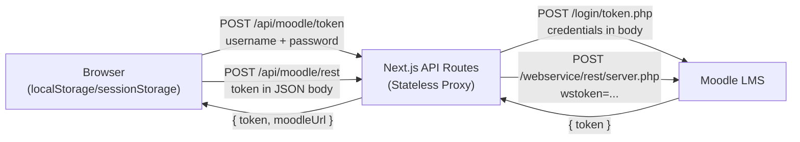

# Security Audit Report: Noti-LMS Task Tracking System

> **Auditor Role**: Senior Application Security Auditor & DevSecOps Expert
> **Scope**: Full-stack security review of Next.js 16 + Moodle REST API integration
> **Date**: 2026-06-24

---

## Executive Summary

The Noti-LMS application acts as a **credential proxy** — it receives Moodle username/password credentials, exchanges them for a Moodle API token, and stores that token entirely on the client side. This architecture introduces several critical and high-severity risks that must be addressed before any production deployment.

### Architecture Diagram (Current State)



> [!CAUTION]
> The Moodle API token is stored in **plaintext** in `localStorage`/`sessionStorage` and transmitted in every API request body. This token grants full `moodle_mobile_app` service access and **never expires** unless manually revoked.

---

## 1. Authentication & Moodle API Credentials Management

### Finding SEC-01: Plaintext Moodle Token in Client Storage (CRITICAL)

**File**: [dashboard-app.tsx](file:///d:/Noppakorn/Noti-LMS-main/components/dashboard-app.tsx#L62-L87)

```typescript
// CURRENT — token stored as plaintext JSON in browser storage
function saveSession(session: MoodleSession) {
  const target = session.remember ? window.localStorage : window.sessionStorage;
  target.setItem(SESSION_KEY, JSON.stringify(session));  // ← token, moodleUrl, user all in plaintext
}
```

**Risk**: Any XSS vulnerability, malicious browser extension, or shared-computer scenario exposes the Moodle token. Since `moodle_mobile_app` tokens are **non-expiring** by default, a stolen token provides permanent access to the victim's Moodle account.

**Remediation**: Move token storage to a server-side session. The browser should only hold an opaque session cookie.

```typescript
// RECOMMENDED — Server-side session with HttpOnly cookie
// app/api/moodle/token/route.ts
import { cookies } from "next/headers";
import { SignJWT, jwtVerify } from "jose";

const SESSION_SECRET = new TextEncoder().encode(process.env.SESSION_SECRET!);

export async function POST(request: Request) {
  // ... existing Moodle token exchange logic ...

  // Create a signed, encrypted session token
  const sessionJwt = await new SignJWT({
    moodleUrl,
    moodleToken: data.token, // Moodle token inside signed JWT
    userId: siteInfo.userid,
  })
    .setProtectedHeader({ alg: "HS256" })
    .setExpirationTime("8h")        // Force re-auth after 8 hours
    .setIssuedAt()
    .sign(SESSION_SECRET);

  // Set as HttpOnly cookie — JavaScript cannot access it
  const cookieStore = await cookies();
  cookieStore.set("noti-session", sessionJwt, {
    httpOnly: true,
    secure: true,                    // HTTPS only
    sameSite: "strict",              // CSRF protection
    path: "/",
    maxAge: 8 * 60 * 60,            // 8 hours
  });

  // Return ONLY non-sensitive user info to the browser
  return NextResponse.json({ user: { id: siteInfo.userid, fullName, profileImage } });
}
```

---

### Finding SEC-02: Plaintext Password Transmission to Proxy (HIGH)

**File**: [authService.ts](file:///d:/Noppakorn/Noti-LMS-main/services/authService.ts#L13-L20)

```typescript
// CURRENT — password sent in JSON body to YOUR server
const response = await fetch("/api/moodle/token", {
  method: "POST",
  body: JSON.stringify(input), // ← { username, password, moodleUrl, remember }
});
```

**Risk**: Your Next.js server receives and processes the raw Moodle password. This means:
- Server logs, APM tools, or error tracking could accidentally capture credentials
- A compromised server gives attackers access to all user passwords in transit
- Memory dumps on the server contain cleartext passwords

**Remediation**:
1. **Never log request bodies** on the `/api/moodle/token` endpoint
2. Add explicit exclusion in any logging middleware:

```typescript
// middleware.ts — strip sensitive fields before logging
export function middleware(request: NextRequest) {
  // Never log the token endpoint body
  if (request.nextUrl.pathname === "/api/moodle/token") {
    // Ensure no body logging occurs
  }
}
```

3. **Long-term**: Consider using Moodle's OAuth2 flow if available, which avoids your server ever seeing passwords.

---

### Finding SEC-03: No Rate Limiting on Authentication Endpoint (HIGH)

**File**: [token/route.ts](file:///d:/Noppakorn/Noti-LMS-main/app/api/moodle/token/route.ts)

The `/api/moodle/token` endpoint has **no rate limiting**. An attacker can perform unlimited brute-force password attempts.

**Remediation**: Implement rate limiting using an in-memory store (for single-instance) or Redis (for distributed):

```typescript
// lib/rate-limit.ts
const attempts = new Map<string, { count: number; resetAt: number }>();

export function checkRateLimit(
  key: string,
  maxAttempts = 5,
  windowMs = 15 * 60 * 1000 // 15 minutes
): { allowed: boolean; retryAfterMs: number } {
  const now = Date.now();
  const entry = attempts.get(key);

  if (!entry || now > entry.resetAt) {
    attempts.set(key, { count: 1, resetAt: now + windowMs });
    return { allowed: true, retryAfterMs: 0 };
  }

  if (entry.count >= maxAttempts) {
    return { allowed: false, retryAfterMs: entry.resetAt - now };
  }

  entry.count++;
  return { allowed: true, retryAfterMs: 0 };
}

// In token/route.ts:
export async function POST(request: Request) {
  const ip = request.headers.get("x-forwarded-for") ?? "unknown";
  const { allowed, retryAfterMs } = checkRateLimit(ip);

  if (!allowed) {
    return NextResponse.json(
      { error: "Too many login attempts. Try again later." },
      {
        status: 429,
        headers: { "Retry-After": String(Math.ceil(retryAfterMs / 1000)) },
      }
    );
  }
  // ... existing logic
}
```

---

### Finding SEC-04: No Token Expiration or Rotation (MEDIUM)

**Current behavior**: The Moodle `moodle_mobile_app` token is obtained once and stored forever. It never expires unless the user explicitly logs out or changes their Moodle password.

**Remediation**:
- Wrap the token in a time-limited JWT (shown in SEC-01 remediation)
- Implement a `/api/moodle/session/validate` endpoint that periodically calls `core_webservice_get_site_info` to verify the token is still valid
- On the client, set a refresh interval:

```typescript
// Check session validity every 30 minutes
const sessionQuery = useQuery({
  queryKey: ["session-check"],
  queryFn: () => fetch("/api/moodle/session/validate").then((r) => {
    if (!r.ok) throw new Error("Session expired");
    return r.json();
  }),
  refetchInterval: 30 * 60 * 1000,
  retry: false,
});

useEffect(() => {
  if (sessionQuery.error) {
    clearSession();
    setSession(null);
  }
}, [sessionQuery.error]);
```

---

## 2. OWASP Top 10 Mitigation

### Finding SEC-05: Server-Side Request Forgery (SSRF) via Moodle URL (CRITICAL)

**File**: [rest/route.ts](file:///d:/Noppakorn/Noti-LMS-main/app/api/moodle/rest/route.ts#L17-L44)

```typescript
// CURRENT — user controls the destination URL
const moodleUrl = normalizeMoodleUrl(body.moodleUrl);
// ...
const response = await fetch(`${moodleUrl}/webservice/rest/server.php`, { ... });
```

**Risk**: A malicious user can set `moodleUrl` to `http://169.254.169.254` (AWS metadata endpoint), `http://localhost:6379` (Redis), or any internal service. Your server will make HTTP requests to arbitrary destinations on behalf of the attacker. This is a **Server-Side Request Forgery (SSRF)** vulnerability.

**Remediation**: Implement a strict URL allowlist:

```typescript
// lib/moodle-url.ts — HARDENED version
const ALLOWED_MOODLE_HOSTS = new Set([
  "lms.psu.ac.th",
  // Add other approved Moodle instances
]);

export function normalizeMoodleUrl(value: unknown): string {
  if (typeof value !== "string") return "";

  const trimmed = value.trim().replace(/\/+$/, "");
  if (!trimmed) return "";

  const withProtocol = /^https?:\/\//i.test(trimmed) ? trimmed : `https://${trimmed}`;

  try {
    const url = new URL(withProtocol);

    // SECURITY: Enforce HTTPS only
    if (url.protocol !== "https:") return "";

    // SECURITY: Block private/internal IPs
    if (isPrivateHost(url.hostname)) return "";

    // SECURITY: Allowlist check
    if (!ALLOWED_MOODLE_HOSTS.has(url.hostname)) return "";

    return `${url.protocol}//${url.host}${url.pathname.replace(/\/+$/, "")}`;
  } catch {
    return "";
  }
}

function isPrivateHost(hostname: string): boolean {
  // Block localhost, private IPs, link-local, metadata endpoints
  const blocked = [
    /^localhost$/i,
    /^127\./,
    /^10\./,
    /^172\.(1[6-9]|2\d|3[01])\./,
    /^192\.168\./,
    /^169\.254\./,
    /^0\./,
    /^\[::1\]$/,
    /^\[fc/i,
    /^\[fd/i,
    /^\[fe80/i,
  ];
  return blocked.some((pattern) => pattern.test(hostname));
}
```

---

### Finding SEC-06: Open Proxy — Arbitrary Moodle Function Execution (HIGH)

**File**: [rest/route.ts](file:///d:/Noppakorn/Noti-LMS-main/app/api/moodle/rest/route.ts#L22-L23)

```typescript
const wsfunction = String(body.wsfunction ?? "");
// No validation — any Moodle web service function can be called
```

**Risk**: The REST proxy allows calling **any** Moodle web service function. An attacker with a valid token could call destructive functions like `core_user_update_users`, `mod_assign_save_submission`, or `core_course_delete_courses` through your proxy.

**Remediation**: Implement a function allowlist:

```typescript
// ALLOWED Moodle API functions — read-only operations
const ALLOWED_WS_FUNCTIONS = new Set([
  "core_webservice_get_site_info",
  "core_enrol_get_users_courses",
  "mod_assign_get_assignments",
  "mod_assign_get_submission_status",
  "mod_quiz_get_quizzes_by_courses",
]);

export async function POST(request: Request) {
  // ...
  const wsfunction = String(body.wsfunction ?? "");

  if (!ALLOWED_WS_FUNCTIONS.has(wsfunction)) {
    return NextResponse.json(
      { error: `Function "${wsfunction}" is not permitted.` },
      { status: 403 }
    );
  }
  // ...
}
```

---

### Finding SEC-07: Cross-Site Scripting (XSS) via Moodle Content (MEDIUM)

**Current state**: Task titles and course names from Moodle are decoded with `decodeHtmlEntities` and rendered. While React's JSX auto-escaping protects against most XSS, there are residual risks:

1. If any component uses `dangerouslySetInnerHTML` for Moodle descriptions in the future
2. If Moodle returns content with embedded `<script>` tags or event handlers

**Remediation**: If you ever need to render rich HTML from Moodle (e.g., assignment descriptions), use a sanitizer:

```typescript
// lib/sanitize.ts
import DOMPurify from "isomorphic-dompurify";

export function sanitizeMoodleHtml(html: string): string {
  return DOMPurify.sanitize(html, {
    ALLOWED_TAGS: ["b", "i", "em", "strong", "a", "p", "br", "ul", "ol", "li", "code", "pre"],
    ALLOWED_ATTR: ["href", "target", "rel"],
  });
}

// Usage in component:
<div dangerouslySetInnerHTML={{
  __html: sanitizeMoodleHtml(task.description)
}} />
```

---

### Finding SEC-08: No CSRF Protection on API Routes (MEDIUM)

The `/api/moodle/*` endpoints accept POST requests with JSON bodies but have **no CSRF token validation**. While `SameSite` cookies provide some protection, the current architecture using `localStorage` tokens means CSRF is less of a concern — but it will become critical once you move to HttpOnly cookies (SEC-01).

**Remediation** (implement alongside SEC-01 cookie migration):

```typescript
// middleware.ts
import { NextResponse } from "next/server";
import type { NextRequest } from "next/server";

export function middleware(request: NextRequest) {
  // Verify Origin header matches our domain for state-changing requests
  if (request.method === "POST") {
    const origin = request.headers.get("origin");
    const host = request.headers.get("host");

    if (origin && !origin.endsWith(host ?? "")) {
      return NextResponse.json({ error: "Forbidden" }, { status: 403 });
    }
  }

  return NextResponse.next();
}

export const config = {
  matcher: "/api/:path*",
};
```

---

### Finding SEC-09: Wildcard Image Remote Patterns (LOW)

**File**: [next.config.ts](file:///d:/Noppakorn/Noti-LMS-main/next.config.ts#L5-L14)

```typescript
remotePatterns: [
  { protocol: "https", hostname: "**" },  // ← allows ANY HTTPS host
  { protocol: "http", hostname: "**" },   // ← allows ANY HTTP host
],
```

**Risk**: Next.js image optimization can be used to proxy images from any domain. An attacker could use this as a limited SSRF vector or to serve malicious content.

**Remediation**: Restrict to known Moodle instance hostnames:

```typescript
remotePatterns: [
  { protocol: "https", hostname: "lms.psu.ac.th" },
  // Add other known Moodle hosts
],
```

---

## 3. Data Protection & Privacy

### Finding SEC-10: No Security Headers (HIGH)

**Files**: [layout.tsx](file:///d:/Noppakorn/Noti-LMS-main/app/layout.tsx), [next.config.ts](file:///d:/Noppakorn/Noti-LMS-main/next.config.ts)

No security headers are configured anywhere.

**Remediation**: Add comprehensive security headers in `next.config.ts`:

```typescript
const nextConfig: NextConfig = {
  images: {
    remotePatterns: [
      { protocol: "https", hostname: "lms.psu.ac.th" },
    ],
  },
  async headers() {
    return [
      {
        source: "/(.*)",
        headers: [
          {
            key: "Content-Security-Policy",
            value: [
              "default-src 'self'",
              "script-src 'self' 'unsafe-inline' 'unsafe-eval'",  // Next.js requires these
              "style-src 'self' 'unsafe-inline'",
              "img-src 'self' https://lms.psu.ac.th data:",
              "connect-src 'self'",
              "font-src 'self'",
              "frame-ancestors 'none'",
              "base-uri 'self'",
              "form-action 'self'",
            ].join("; "),
          },
          { key: "X-Content-Type-Options", value: "nosniff" },
          { key: "X-Frame-Options", value: "DENY" },
          { key: "X-XSS-Protection", value: "0" },  // Deprecated; CSP replaces it
          { key: "Referrer-Policy", value: "strict-origin-when-cross-origin" },
          { key: "Permissions-Policy", value: "camera=(), microphone=(), geolocation=()" },
          {
            key: "Strict-Transport-Security",
            value: "max-age=31536000; includeSubDomains; preload",
          },
        ],
      },
    ];
  },
};
```

---

### Finding SEC-11: HTTP Allowed for Moodle Connections (MEDIUM)

**File**: [moodle-url.ts](file:///d:/Noppakorn/Noti-LMS-main/lib/moodle-url.ts#L7)

```typescript
const withProtocol = /^https?:\/\//i.test(trimmed) ? trimmed : `https://${trimmed}`;
// ← Accepts http:// URLs — credentials and tokens transmitted in cleartext
```

**Risk**: If a user enters `http://lms.example.edu`, credentials and tokens are transmitted unencrypted over the network.

**Remediation**: Enforce HTTPS-only (shown in SEC-05 fix).

---

### Finding SEC-12: Session Lifecycle Not Synchronized with Moodle (LOW)

**Current behavior**: The client-side session persists indefinitely in `localStorage`. Even if the Moodle admin revokes the token or the user changes their password, the application continues to attempt API calls with the stale token.

**Remediation**: Covered in SEC-04 (periodic validation). Additionally, handle 401 responses gracefully:

```typescript
// services/moodleClient.ts — enhanced error handling
export async function moodleCall<T>(session: Pick<MoodleSession, "moodleUrl" | "token">, wsfunction: string, params = {}) {
  const response = await fetch("/api/moodle/rest", { ... });
  const data = await response.json();

  // Handle expired/revoked token
  if (data?.errorcode === "invalidtoken" || data?.errorcode === "accessexception") {
    // Dispatch a custom event to trigger logout
    window.dispatchEvent(new CustomEvent("noti-lms:session-expired"));
    throw new Error("Your Moodle session has expired. Please log in again.");
  }

  if (!response.ok || data?.exception || data?.error) {
    throw new Error(data?.message ?? data?.error ?? "Moodle request failed.");
  }

  return data as T;
}
```

---

## 4. Priority Matrix & Actionable Checklist

### 🔴 CRITICAL — Implement Before Any Production Use

| # | Finding | File(s) | Effort |
|---|---------|---------|--------|
| SEC-05 | **SSRF via user-controlled Moodle URL** — attacker can make your server request internal services | [moodle-url.ts](file:///d:/Noppakorn/Noti-LMS-main/lib/moodle-url.ts), [rest/route.ts](file:///d:/Noppakorn/Noti-LMS-main/app/api/moodle/rest/route.ts) | 1 hour |
| SEC-01 | **Plaintext token in localStorage** — any XSS or extension steals permanent Moodle access | [dashboard-app.tsx](file:///d:/Noppakorn/Noti-LMS-main/components/dashboard-app.tsx#L62-L87) | 4 hours |
| SEC-06 | **Open proxy to any Moodle function** — attacker can modify/delete data through your server | [rest/route.ts](file:///d:/Noppakorn/Noti-LMS-main/app/api/moodle/rest/route.ts) | 30 min |

### 🟠 HIGH — Implement Before Beta/Staging

| # | Finding | File(s) | Effort |
|---|---------|---------|--------|
| SEC-03 | **No rate limiting on login** — enables brute-force password attacks | [token/route.ts](file:///d:/Noppakorn/Noti-LMS-main/app/api/moodle/token/route.ts) | 1 hour |
| SEC-10 | **No security headers** — missing CSP, HSTS, X-Frame-Options | [next.config.ts](file:///d:/Noppakorn/Noti-LMS-main/next.config.ts) | 1 hour |
| SEC-02 | **Password handling risk** — ensure no accidental logging of credentials | [token/route.ts](file:///d:/Noppakorn/Noti-LMS-main/app/api/moodle/token/route.ts) | 30 min |

### 🟡 MEDIUM — Implement Before General Availability

| # | Finding | File(s) | Effort |
|---|---------|---------|--------|
| SEC-04 | **No token expiration** — stolen tokens work forever | [dashboard-app.tsx](file:///d:/Noppakorn/Noti-LMS-main/components/dashboard-app.tsx) | 2 hours |
| SEC-08 | **No CSRF protection on API** — needed after cookie migration | New: `middleware.ts` | 1 hour |
| SEC-07 | **Potential XSS from Moodle HTML** — needs sanitizer if rich content is rendered | New: `lib/sanitize.ts` | 1 hour |
| SEC-11 | **HTTP allowed for Moodle** — credentials sent in cleartext | [moodle-url.ts](file:///d:/Noppakorn/Noti-LMS-main/lib/moodle-url.ts) | 15 min |

### 🟢 LOW — Best Practice Hardening

| # | Finding | File(s) | Effort |
|---|---------|---------|--------|
| SEC-09 | **Wildcard image patterns** — restrict to known Moodle hosts | [next.config.ts](file:///d:/Noppakorn/Noti-LMS-main/next.config.ts) | 5 min |
| SEC-12 | **Session lifecycle not synced** — stale tokens cause confusing errors | [moodleClient.ts](file:///d:/Noppakorn/Noti-LMS-main/services/moodleClient.ts) | 1 hour |

---

## Quick-Win Implementation: SSRF + Function Allowlist (SEC-05 + SEC-06)

These two critical fixes can be implemented immediately with minimal code changes:

### Step 1: Harden [moodle-url.ts](file:///d:/Noppakorn/Noti-LMS-main/lib/moodle-url.ts)

```typescript
const ALLOWED_MOODLE_HOSTS = new Set([
  "lms.psu.ac.th",
]);

export function normalizeMoodleUrl(value: unknown): string {
  if (typeof value !== "string") return "";
  const trimmed = value.trim().replace(/\/+$/, "");
  if (!trimmed) return "";

  const withProtocol = /^https:\/\//i.test(trimmed) ? trimmed : `https://${trimmed}`;

  try {
    const url = new URL(withProtocol);
    if (url.protocol !== "https:") return "";
    if (!ALLOWED_MOODLE_HOSTS.has(url.hostname)) return "";
    return `${url.protocol}//${url.host}${url.pathname.replace(/\/+$/, "")}`;
  } catch {
    return "";
  }
}
```

### Step 2: Add function allowlist to [rest/route.ts](file:///d:/Noppakorn/Noti-LMS-main/app/api/moodle/rest/route.ts)

```typescript
const ALLOWED_WS_FUNCTIONS = new Set([
  "core_webservice_get_site_info",
  "core_enrol_get_users_courses",
  "mod_assign_get_assignments",
  "mod_assign_get_submission_status",
  "mod_quiz_get_quizzes_by_courses",
]);

export async function POST(request: Request) {
  try {
    const body = await request.json();
    const wsfunction = String(body.wsfunction ?? "");

    if (!ALLOWED_WS_FUNCTIONS.has(wsfunction)) {
      return NextResponse.json({ error: "Function not permitted." }, { status: 403 });
    }
    // ... rest of existing logic
  }
}
```

---

## Summary of Current Security Posture

| Category | Current Grade | After Remediation |
|----------|:---:|:---:|
| Authentication & Session | 🔴 D | 🟢 A |
| SSRF / Injection | 🔴 F | 🟢 A |
| Authorization (BOLA) | 🟡 C | 🟢 B+ |
| XSS Protection | 🟢 B+ | 🟢 A |
| Transport Security | 🟡 C | 🟢 A |
| Security Headers | 🔴 F | 🟢 A |
| Rate Limiting | 🔴 F | 🟢 A |

> [!IMPORTANT]
> **SEC-05 (SSRF) and SEC-06 (Open Proxy) are the most urgent items.** They require ~90 minutes combined and eliminate the two most exploitable attack vectors in the current codebase. Implement them before any deployment.
